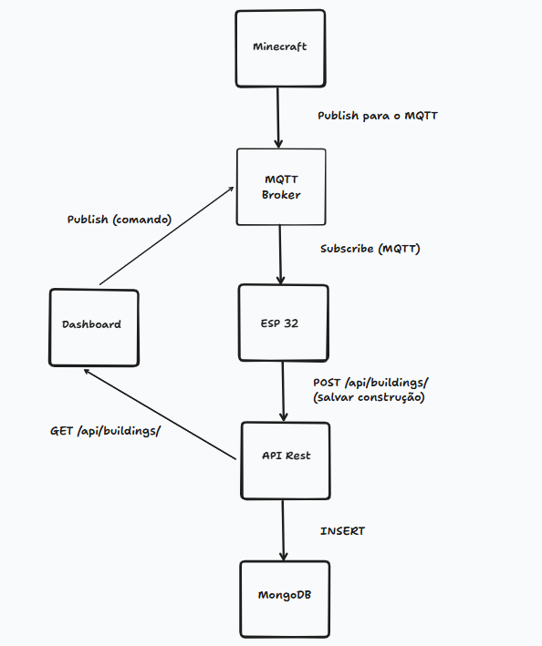
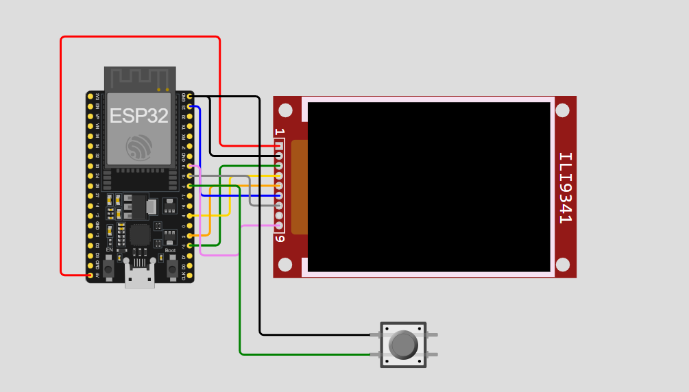
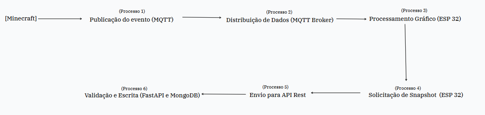

### Arquitetura

- Link para a arquitetura: https://www.tldraw.com/f/l_U2bMSdWrSGBn0xmnwe0?d=v-241.588.2343.1339.page

### Desenho Circuito

### Diagrama de Fluxo de Dados

- Link para o diagrama: https://www.tldraw.com/f/l_U2bMSdWrSGBn0xmnwe0?d=v1621.257.2343.1339.page

### Identificação de Edge Computing
- O projeto aplica os conceitos de Edge Computing diretamente no microcontrolador ESP32 para otimizar o fluxo de dados e a performance do sistema:

  - Agregação: Ao acionar a persistência, a ESP32 consolida o estado completo da construção (Processo 4) em um único snapshot JSON antes de enviá-lo para a API. Isso evita o envio fragmentado de cada bloco, reduzindo o número de requisições ao banco de dados e a carga no servidor FastAPI.

  - Compressão: Em vez de trafegar buffers de imagem pesados ou modelos 3D complexos, o sistema utiliza uma compressão lógica, enviando apenas coordenadas e tipos de blocos via JSON. A ESP32 "descomprime" essa lógica localmente através de transformações de computação gráfica para renderizar os pixels no display ST7735 (Processo 3).
___
### Ferramentas que serão usadas:
* **ESP32:** Microcontrolador com Wi-Fi nativo para processamento e comunicação.
* **Display LCD ST7735 (128x160):** Saída visual para o holograma.
* **Minecraft Paper**: Servidor para minecraft, que irá permitir a criação de um plugin para comunicação com o MQTT.

### Formato de dados:
* **JSON:** Estruturação de dados para intercâmbio entre o Minecraft, API e o hardware.

### Qual BD de persistência:
* **MongoDB:** Banco de dados NoSQL para armazenamento de estados e logs.

### Linguagem para a API:
* **Python (FastAPI):** Backend assíncrono para garantir baixa latência na integração IoT.

### Qual a plataforma para prototipagem:
* **Wokwi:** Utilizado para simular o comportamento do ESP32, a pinagem do display e validar a stack de rede antes da montagem física. Foi escolhido ao invés do Tinkercad, já que no Tinkercad não há suporte nativo para o microcontrolador ESP32 nem simulação de conectividade Wi-Fi.
